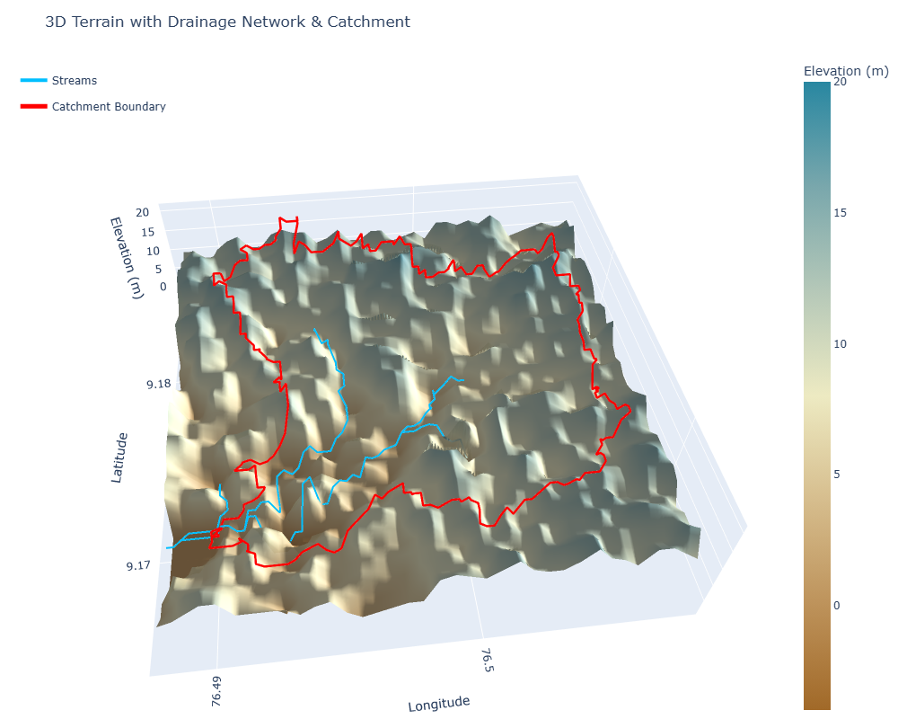

# Python for GIS: 3D Terrain Visualization & Hydrological Analysis (SRTM DEM)

An end-to-end Python workflow that pulls SRTM elevation data via Google Earth Engine, derives standard terrain products (slope, aspect, hillshade), performs full hydrological terrain analysis (flow direction, flow accumulation, catchment delineation) with `pysheds`, and renders both an interactive 2D stream-picker map and a 3D terrain visualization with drainage overlay.



## Overview

1. **Pull SRTM DEM (30 m)** for a bounding box via Earth Engine, using `ee.Terrain` to derive slope, aspect, and hillshade directly on the server side
2. **Open as `xarray`/`rioxarray`** via `xee`, with the usual dimension-order and CRS fixes applied
3. **Visualize terrain products** (elevation, slope, aspect, hillshade) as a 2×2 static panel, and elevation as an interactive 3D Plotly surface
4. **Hand the DEM to `pysheds`** (via an in-memory `Raster`/`ViewFinder`, no disk round-trip) to run the standard hydrological conditioning pipeline: pit filling → depression filling → flat resolution → flow direction → flow accumulation
5. **Build an interactive `ipyleaflet` map** letting the user click a point on the DEM/derivative layers and dynamically:
   - Snap the click to the nearest stream pixel (based on a flow-accumulation threshold)
   - Delineate the upstream catchment for that point
   - Adjust the stream threshold live via a slider and see the stream network update
6. **Polygonize the delineated catchment** into a clean, dissolved vector polygon and export as a Shapefile
7. **Render a combined 3D terrain figure** — DEM surface with the derived stream network and catchment boundary draped on top

## Data Sources

| Data | Source |
|---|---|
| Elevation (30 m) | [`USGS/SRTMGL1_003`](https://developers.google.com/earth-engine/datasets/catalog/USGS_SRTMGL1_003) via Google Earth Engine |
| Slope / Aspect / Hillshade | Derived server-side via `ee.Terrain` |

## Method Notes

- **In-memory DEM → pysheds bridge**: rather than writing the DEM to disk and reloading it, the notebook builds a `pysheds.sview.Raster` directly from the `xarray` DEM's NumPy values plus its `rioxarray`-derived affine transform and CRS — a cleaner, faster pattern than the file-based examples common in `pysheds` tutorials.
- **Standard hydrological conditioning order matters**: pit filling → depression filling → flat resolution, run in that sequence, before flow direction/accumulation — skipping or reordering these steps produces broken or fragmented drainage networks.
- **Stream extraction is threshold-based**: a pixel is classified as a stream if its flow accumulation exceeds a chosen threshold; this notebook exposes that threshold as a live `ipywidgets` slider so the resulting stream network can be tuned interactively rather than guessed at once and rerun.
- **Catchment delineation is interactive**: clicking any point on the `ipyleaflet` map snaps to the nearest stream cell (`grid.snap_to_mask`) and delineates everything upstream of it (`grid.catchment`) — this is a standard "pour point" watershed delineation, done live rather than pre-computed for a fixed set of outlets.
- **Raster-to-vector conversion** uses `rasterio.features.shapes` to polygonize the boolean catchment mask, followed by a `dissolve()` to merge pixel-edge fragments into one clean polygon before exporting to Shapefile.
- **Same `xee`/`rioxarray` dimension-naming friction as the companion notebooks applies here** — `dem` is explicitly renamed from `lat`/`lon` to `y`/`x` before handing off to `rioxarray`/`pysheds`, which both expect that convention.

## Tech Stack

- `earthengine-api` (`ee`) + [`xee`](https://github.com/google/Xee) — DEM/terrain data access
- `xarray` / `rioxarray` — gridded array handling, CRS, affine transforms
- [`pysheds`](https://github.com/pysheds/pysheds) — flow direction, accumulation, catchment delineation
- `rasterio` — raster-to-vector polygonization
- `geopandas` / `shapely` — vector handling and export
- `matplotlib` — static terrain panel plots
- `plotly` — interactive 3D terrain surface
- `ipyleaflet` / `ipywidgets` — interactive click-to-delineate map and threshold slider
- `Pillow` (`PIL`) — in-memory raster-to-PNG overlay generation for the Leaflet map

## Repository Structure

```
.
├── Python_for_GIS_DEM_3D.ipynb       # Main analysis notebook
├── terrain_3d_drainage.png           # 3D terrain + drainage + catchment figure
└── README.md
```

## Outputs

- 2×2 static terrain panel: elevation, slope, aspect, hillshade
- Interactive 3D Plotly terrain surface
- Interactive `ipyleaflet` map with clickable point-based catchment delineation and a live stream-threshold slider
- `catchment.shp` — dissolved vector polygon of the delineated catchment
- Combined 3D terrain visualization with drainage network and catchment boundary overlaid (see figure above)

## Getting Started

```bash
pip install earthengine-api xee xarray rioxarray numpy matplotlib plotly pysheds rasterio geopandas shapely ipyleaflet ipywidgets pillow affine
```

You'll need a Google account registered for Earth Engine access and a Google Cloud Project with the Earth Engine API enabled. Run `ee.Authenticate()` once, then `ee.Initialize(project='your-gcp-project-id', opt_url='https://earthengine-highvolume.googleapis.com')`.

**Note:** the interactive `ipyleaflet` map and Plotly 3D surface require a live Jupyter environment (classic Notebook, JupyterLab, or VS Code's notebook interface) — they won't render as static output in a plain script or non-interactive export.


